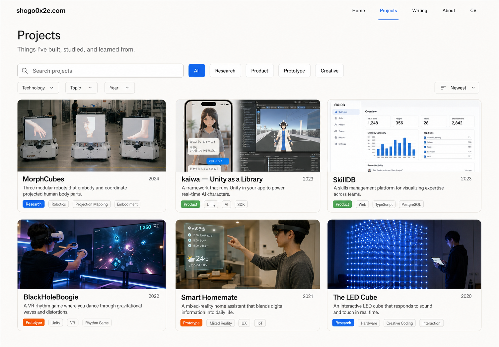

# Design direction

## Goal

技術ポートフォリオとして、速く理解できることを優先する。

好奇心や変化は、宇宙、サイバーパンク、抽象的なナビゲーションで直接表現しない。多様な成果物、写真、短いコピー、プロジェクト内の判断と学びから伝える。

## Visual principles

### Conventional first

ヘッダー、検索、フィルタ、カード、詳細ページは、初見で用途が分かる形にする。独自性のために操作方法を学ばせない。

### Technical, but human

画面キャプチャだけで埋めず、制作現場、実験装置、チーム、展示、旅先などの写真を使う。技術が現実の人や場所と接続していることを見せる。

### Editorial clarity

グリッド、タイポグラフィ、余白を中心に設計する。装飾より、タイトル、写真、要約の順序を明確にする。

### Quiet curiosity

未知への好奇心は、控えめなアクセント、異なる分野の写真、現在進行中の問いで表現する。巨大なスローガンや過剰なアニメーションには依存しない。

## Projects page concept v1



初期モックアップでは、次を検証した。

- 一般的なナビゲーションで迷わないか。
- Projectsに研究とプロダクトが混在しても、種別バッジで理解できるか。
- 検索とフィルタがページの主役として認識できるか。
- 写真、題名、一行要約、タグだけでカードを走査できるか。
- 既存ポートフォリオの青を残しつつ、古い資料の印象を引きずりすぎないか。

画像内の年、説明、画面、プロジェクト写真はコンセプト用の仮データである。事実情報や実際の成果物として利用しない。

## Provisional visual language

- Background: warm off-white
- Text: near black
- Primary accent: vivid cyan to blue
- Secondary accent: small amounts of warm orange
- Typography: modern grotesk sans-serif
- Corners: slightly rounded
- Borders: thin and neutral
- Shadows: restrained
- Photography: authentic, documentary, project-specific

色はまだブランド決定ではない。既存ポートフォリオとの連続性を検討するための出発点である。

## Card behavior

- 画像比率を統一し、行ごとの高さを安定させる。
- hoverだけに情報を隠さない。
- タイトルと一行要約は常時表示する。
- 種別は色だけに依存せず、文字ラベルを表示する。
- キーボードフォーカスを明示する。
- 長いタグや日本語・英語の混在で高さが崩れないか確認する。
- モバイルでは1列、タブレットでは2列、デスクトップでは3列を基本とする。

## Accessibility baseline

- 本文とUIはWCAG AA相当のコントラストを確保する。
- 検索、Filter、Sortをキーボードだけで操作できるようにする。
- Filterの選択状態を色だけで表現しない。
- プロジェクト画像へ内容に応じた代替テキストを付ける。
- motionは`prefers-reduced-motion`を尊重する。
- 文字サイズと行間を、見た目の密度より優先する。

## Existing resources

### Previous portfolio

- Source: private reference material（not included in this repository）
- 15ページ、2026-07-27生成
- 青いグラデーション、白背景、活動年表、技術スタック、案件別ケーススタディで構成

過去資料から引き継げるもの:

- 青を中心とした識別性
- 写真と技術情報を組み合わせる方針
- 活動を時系列で残す姿勢
- 役割、内容、技術スタック、関連リンクを明記する構造

見直すもの:

- 技術ロゴ中心のスキル表現
- スライドとしてのページ分割
- 2024年までの自己定義に固定された紹介文
- 実績一覧と現在の価値観が接続されていない点

### Research and writing references

- [遠隔話者の身体性を表現するロボット群テレプレゼンスシステムの評価](https://ipsj.ixsq.nii.ac.jp/records/2007519)
- [Interactive Media Lab publications](https://sites.google.com/shibaura-it.ac.jp/iml/publication)
- [Unity as a Library を Expo Modules で楽に運用する](https://zenn.dev/livetoon/articles/expo-uaal-prep)
- [Next.js Conf 2024 全部聞いてみた](https://zenn.dev/shogo0x2e/articles/770146f4f89ae2)

## Generation prompt for concept v1

The mockup was generated with the built-in image generation tool using the following design brief.

```text
Design a high-fidelity desktop Projects page for shogo0x2e.com.
Use a conventional, readable technical-portfolio layout with a compact header,
Projects introduction, prominent search, type filters, Technology/Topic/Year
filters, Newest sort, and a three-column grid of project cards.

Each card contains an authentic project image, title, year, one-line summary,
type badge, and two to four tags. Include concepts for Robotic Telepresence, kaiwa —
Unity as a Library, SkillDB, BlackHoleBoogie, Smart Homemate, and The LED Cube.

Use contemporary Japanese/Swiss editorial design, generous whitespace,
warm off-white, near-black text, cyan-to-blue accents, and restrained orange.
Keep it technical and human. Avoid unconventional category names, galaxy imagery,
cyberpunk, glassmorphism, excessive gradients, giant decorative type, and dark UI.
```

## Next design review

次の画面案では、良い点を増やす前に違和感を特定する。

- 情報密度は高すぎないか、低すぎないか。
- 青は本人らしさにつながるか、過去資料の惰性に見えるか。
- 写真中心のカードが、技術的な深さを弱めていないか。
- Filterの数と粒度は、実際の掲載件数に対して妥当か。
- 日本語主体、英語主体、日英併記のどれが自然か。
- トップページにも同じカードを使うか、代表作だけ別表現にするか。
